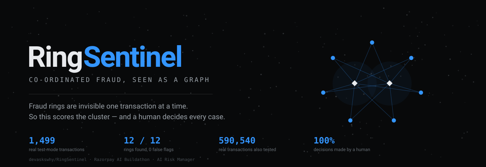
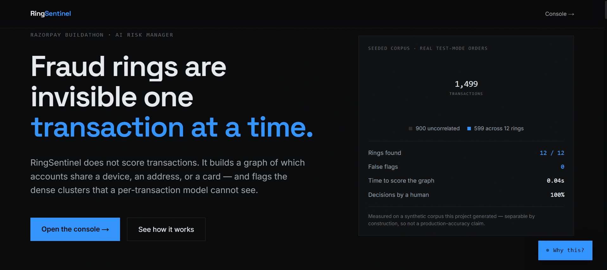
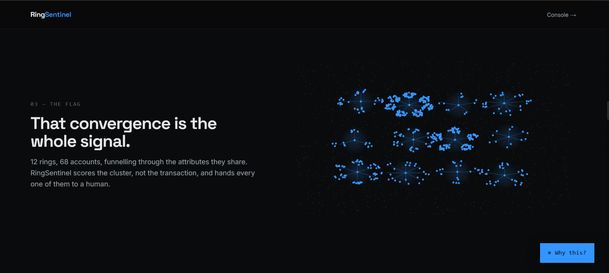
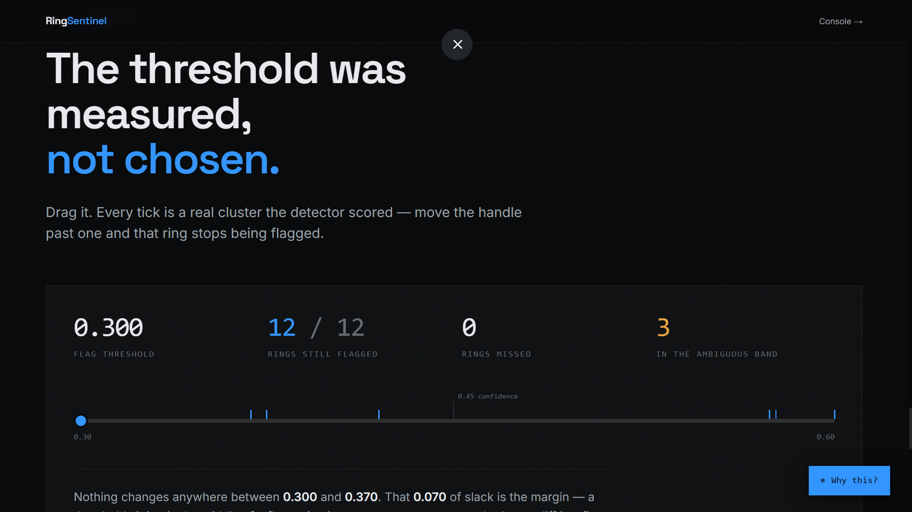
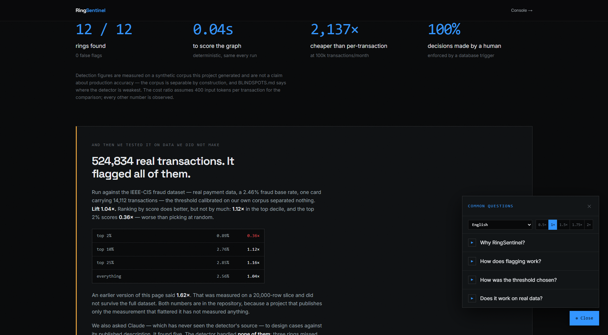
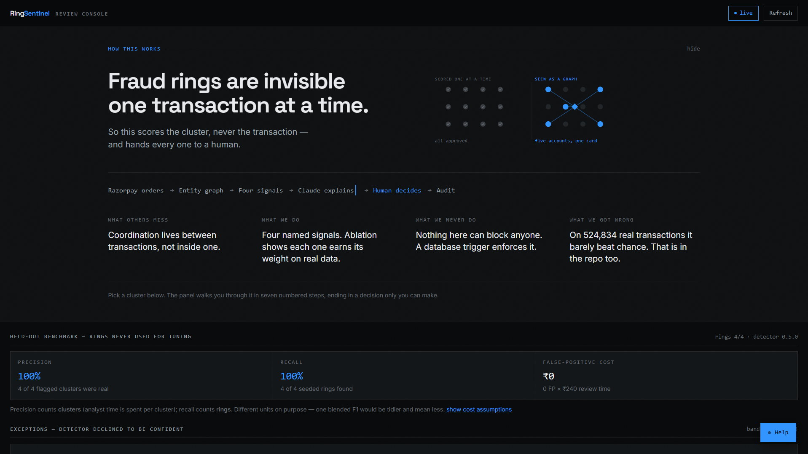
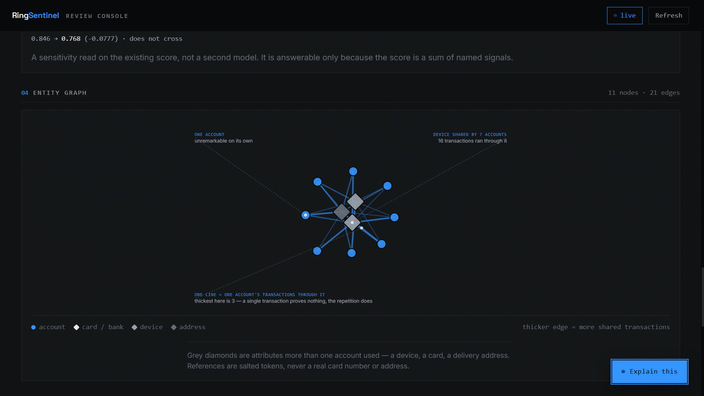
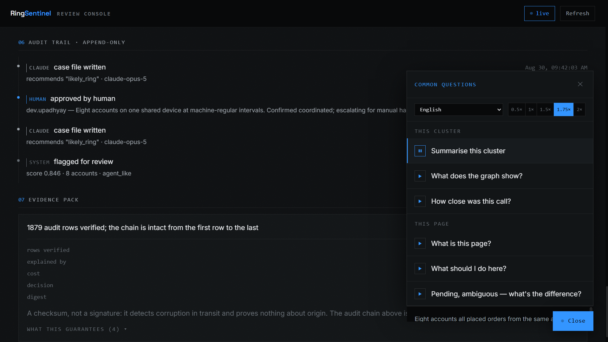

<p align="center">
  
</p>

# RingSentinel

**Razorpay AI Buildathon · AI Risk Manager track**

[**Live site**](https://ring-sentinel-khaki.vercel.app) · [**API**](https://ringsentinel.onrender.com/docs) · [Architecture](ARCHITECTURE.md) · [Where it's weak](BLINDSPOTS.md) · [How it makes money](MONETIZATION.md) · [Deploying](DEPLOY.md)

> Most fraud tools score one payment at a time. That works for a stolen card and
> cannot work for a ring, because **coordination does not exist inside a single
> transaction — it exists between them.**
>
> RingSentinel builds a graph of which accounts share a device, an address, or a
> card, scores the *cluster*, has Claude explain it in plain language, and puts a
> human in front of every decision. **Nothing auto-blocks. Ever.**

---

<p align="center">
  
</p>

---

## The one-minute version

|  |  |
|---|---|
| **Problem** | Card-testing, promo-farming and return-abuse crews are invisible per transaction. Each order is small, valid, in policy — and the coordination only shows up as a shape across accounts. |
| **Approach** | Graph the shared attributes. Cluster. Score with four named signals. Explain with Claude. Gate on a human. |
| **On our corpus** | **12/12 rings found, 0 false flags** — including 4/4 on a held-out split opened once |
| **On real data** | Honest failure: **1.12× top-decile lift** on 524,834 IEEE-CIS transactions we did not generate — measured, published, not deployed |
| **What it will never do** | Block, freeze or decline anyone. No code path exists; a Postgres trigger enforces it |
| **Cost** | **$0.07/month** of model spend at 100k transactions — 2,137× cheaper than scoring each one |

---

## Why this track, and why this idea

The AI Risk Manager brief asks for *"a working detector… with measured precision
and recall on a held-out test set"* and sets one hard rule: **"strictly
defense-only: anything offense-capable is disqualified."** It lists
*"abuse-ring sentinel"* as an example direction.

Most entries to a track like this will build a per-transaction classifier. That
is the obvious move and it cannot solve the stated problem, because a single
transaction contains no evidence of coordination — however good the model is.
This is not an argument about model quality. It is definitional.

So RingSentinel makes the opposite bet: **the unit of detection is the cluster,
never the payment.** Everything else follows from that one decision — why the
score decomposes into named signals, why the cost is three orders of magnitude
lower, why a human can actually review the output, and why the same design would
extend across merchants in a way no single merchant could replicate.

---

## How it works

```
Razorpay test-mode orders          real orders, real order_… ids
        │
        ▼
POST /webhooks/razorpay            HMAC-SHA256 over the raw body
        │
        ▼
app/ingest.py                      entities · entity_links · transactions
        │                          idempotent: ON CONFLICT DO NOTHING
        ▼
detection/                         NetworkX graph → clusters → four-signal score
        │                          deterministic; reads a label-free view only
        ▼
app/case_files.py                  Claude writes the explanation
        │                          allowed_tools=[] — no function to call
        ▼
app/routers/clusters.py            ▐ THE HUMAN GATE
                                   approve / dismiss, written reason required
                                   enforced by a Postgres trigger
        ▼
audit_log                          append-only, hash-chained
```

### The four signals

Every weight lives in one file (`detection/config.py`). Nothing numeric is
buried in the scoring code.

| Signal | Weight | Question it asks |
|---|---|---|
| Attribute reuse | **0.45** | How many separate accounts funnel through one card, device or address? |
| Timing regularity | **0.25** | Do the gaps look like a person, or a script? |
| Concentration | **0.15** | How much of the cluster's volume runs through the shared attribute? |
| Account shallowness | **0.15** | Do these accounts have real histories, or exist for one discounted order? |

**Attribute type weights are the point**: instrument `1.00`, device `0.85`,
address **`0.40`**. A shared delivery address is a household far more often than
a crew, so address overlap alone cannot flag a cluster. That weight is what
keeps a family from being treated as a ring — and it has a measured cost, which
is reported rather than defended.

---

## The results, including the ones that hurt

### On the seeded corpus

1,499 transactions built from **real Razorpay test-mode orders** — every row
traces to a genuine `order_…` id fetchable from Razorpay.

| Metric | Held-out (rings 9–12) | Tuning (rings 1–8) |
|---|---|---|
| Rings detected | **4/4 (100%)** | 8/8 (100%) |
| Cadence classified correctly | **4/4** | 8/8 |
| False flags | **0** | 0 |
| Clean accounts swept in | 0 of 105 | 0 of 105 |
| Runtime | 0.04s, deterministic | — |

Rings 9–12 were sealed from generation and opened once, with the config verified
byte-identical to the commit that produced it. Nothing was tuned afterwards.

> ⚠️ **What this does and does not mean.** This is a synthetic corpus *this
> project generated*, and it is separable by construction: the busiest benign
> attribute is shared by 3 accounts while rings reach 9. So 100% means the
> detector does what it was designed to do on data of this shape. It is not a
> claim about production accuracy, and anyone quoting it should say so.

### On real data we did not create

Because the caveat above is not good enough on its own, the same detector was
run unmodified against **IEEE-CIS Fraud Detection**: 590,540 real transactions,
of which **524,834** carry the card and address fields this needs, at a
**2.46%** fraud base rate. One card in that data carries 14,112 transactions;
the busiest attribute in our own corpus is shared by nine accounts.

**It failed, and the failure is committed before any attempt to fix it.** At the
calibrated threshold the detector flagged **100% of candidates** with a lift of
**1.04×**. The diagnostics say why: attribute reuse saturates because real
clusters run to 1,568 accounts, and the assumption that sharing above a small
floor is suspicious does not survive real payment data.

Ranking by score does better than the threshold, but not by much:

| Slice by score | Fraud rate | Lift |
|---|---|---|
| top 2% | 0.89% | **0.36× — worse than the base rate** |
| top 10% | 2.76% | **1.12×** |
| top 25% | 2.85% | 1.16× |
| top 50% | 2.61% | 1.06× |
| everything | 2.56% | 1.04× |

**A weak but non-zero ranking signal, below what would justify deploying this
against real traffic.** That is the tool's own verdict and it is not softened
here.

> ⚠️ **An earlier number in this repository was wrong, and the correction is
> the point.** The first real-data run used a 20,000-row slice and showed
> **1.62×** top-decile lift. On the full 524,834 rows it falls to **1.12×**, and
> the top 2% — the most confident predictions — scores **0.36×**, worse than
> picking at random. The slice result was a small-sample artefact. Both are kept
> so the mistake is visible, because a project that only publishes the
> measurement that flattered it has not measured anything.

```bash
docker compose exec backend python -m scripts.evaluate_ieee --limit 0   # all 524,834
```

### Does the scorer beat a one-line heuristic?

Nothing in the repo answered this until it was measured. Same graph, same
clustering, same candidates — only the flagging rule changes.

| Rule | Recall | Precision | False flags |
|---|---|---|---|
| **RingSentinel** | 100% | **100%** | 0 |
| Naive: any attribute shared by ≥3 accounts | 100% | 92% | 1 |
| Attribute reuse alone | 92% | 92% | 1 |
| Largest clusters | 92% | 92% | 1 |
| Random | 75% | 75% | 3 |

Honest reading: **on this corpus the four signals buy one avoided false positive
over a rule that fits on one line.** That is a weak justification, and it is
published rather than hidden.

### So does each signal earn its weight?

Ablation is the one place a 20,000-row slice is still the right instrument:
holding the sample fixed is what makes the five runs comparable, and the
*differences* between rows are the finding, not the absolute figures. Every
number in the right-hand column is from that same slice.

| Weighting | Seeded recall | Top-decile lift *(20k slice)* |
|---|---|---|
| All four signals | 100% | **1.62×** |
| without attribute reuse | 67% | 1.35× |
| without timing regularity | **100%** (no cost) | 1.35× |
| without concentration | **100%** (no cost) | 1.37× |
| without account shallowness | 92% | 1.51× |

**The two signals that look like dead weight on synthetic data are among the
most valuable on real data.** The seeded corpus is separable by attribute reuse
alone, so the behavioural signals never get a chance to matter; on real data,
where sharing a card is ubiquitous and uninformative, timing and concentration
are what discriminate.

That is the strongest available answer to *"why four signals?"* — and it could
only be obtained by testing on data this project did not generate.

---

## What it deliberately cannot do

This is the part enforced by the database, not by good intentions.

| Guarantee | How it is enforced |
|---|---|
| **No automated blocking, freezing or declining** | No code path exists to call. Clusters only ever change `status`, and only from a human review action |
| **Every decision is human-made** | `trg_clusters_status_human_only` rejects any status change outside a transaction carrying `ringsentinel.human_review` **and** a written reason of ≥5 characters |
| **A decision is never revised** | The same trigger refuses to move a cluster *out* of a decided state, even inside a review — otherwise the audit log would contradict the row |
| **The audit log is never rewritten** | Append-only trigger raises on UPDATE / DELETE / TRUNCATE |
| **Tampering is detectable, not merely blocked** | Every row stores `sha256(prev_hash ‖ row)`. Someone with raw database access can drop a trigger; they cannot make the arithmetic add up afterwards |
| **The detector never sees ground truth** | Detection reads `v_transactions_detector`, a view without the label column. An AST walk fails the build if any module under `detection/` names it |
| **Claude explains, never decides** | Prompt says so; `allowed_tools=[]` means no function exists; the trigger refuses it anyway. Three independent layers |

Hand this to anyone who wants to check rather than be told — it exits non-zero
the moment a guarantee breaks:

```bash
docker compose exec backend python -m scripts.verify_human_gate
```

Both tamper paths were tested by actually breaking them. Rewriting a decided
row's reason was caught as *"the row's contents no longer hash to its recorded
hash"*; dropping the guard trigger was caught as a missing trigger.

---

## Where AI is used, and where it deliberately is not

Built on the **Claude Agent SDK** — the same SDK Razorpay used for Agent Studio.

Claude does exactly two things, and neither is detection:

1. **Writes the case file** that explains a flagged cluster to the analyst.
2. **Designs the blind-spot tests.** BLINDSPOTS.md carried a caveat it could not
   answer for itself — *"the cases share an author with the detector"* — so
   Claude, which has never seen the source, designs cases from the published
   description alone. It returns a *specification*; our code realises it.

Detection itself is deterministic graph and statistics work. No model output
influences whether a cluster is flagged, what it scores, or what happens to it.

**That split is the point.** An LLM asked to score 1,499 transactions would be
slower, more expensive, non-reproducible and impossible to audit — and worse at
the task, because the signal lives in the graph rather than in any transaction's
text. Using a model for the part that needs language, and refusing to use it for
the part that needs determinism, is what "AI applied appropriately" means here.

### What Claude found that we did not

Given only the published design, it produced five cases. **The detector handled
none of them** — three rings missed, and two innocent cases wrongly flagged:

| Case | Outcome |
|---|---|
| Ring rotating instruments in pairs | missed — every attribute sits under the 3-account floor |
| Reshipping ring sharing only addresses | missed — exploits the deliberate 0.40 address weight |
| Aged mule pool, k held at 3 | missed — sits where the saturation curve is weakest |
| Family sharing card, device and address | **wrongly flagged at 0.55** |
| Campus kiosk cohort on scheduled top-ups | **wrongly flagged at 0.57** |

We then built the obvious fix — a `linkage` signal that counts attributes below
the evidence floor — measured it, and **left it switched off**:

| linkage weight | address-only ring | family (innocent) |
|---|---|---|
| 0.00 *(shipped)* | missed | flagged 0.547 |
| 0.20 | **caught** | **worse: 0.747** |
| 0.35 | caught | much worse: 0.897 |

A household sharing a card, a device and an address is the most tightly-joined
thing in any graph, so a signal rewarding joinedness cannot separate one from a
crew. Enabling it would trade a missed ring for a wrongly flagged family. **For
a system whose entire claim is that it does not act on people, that is the worse
error.** The capability exists, is measured, and is documented as *not adopted*.

---

## The two surfaces

### The landing page

Four beats: the problem → the mechanism → the flag → the gate. The scroll
sequence is **every one of the 1,499 real transactions** on a canvas: 900 stay
scattered, 599 migrate into the twelve real rings. With eighteen hand-placed
dots, *"nothing is added, the data was always this shape"* is a claim. At real
scale it is a demonstration.

Section 06 is a **threshold scrubber**: drag the flag threshold and watch rings
drop out, with every tick a real cluster score. It states the calibration
argument as you move it — *nothing changes anywhere between 0.300 and 0.370* —
and refuses to go below 0.30, because the detector stores nothing there and
inventing a number would be fabrication.

### The review console

Land on the queue. Pick a cluster and its full case opens below in seven
numbered steps: case file → four signals → how close it was → the graph →
your decision → the audit trail → **verify the chain**, which rebuilds the
evidence pack and re-checks all 1,879 rows live.

Spoken explanations in eight languages sit behind a help card — real
translations, not an English script read by a foreign voice. A cluster's case
file is read aloud in Claude's own words, labelled *"Claude's case file ·
English only"*, because machine-translating an artefact the audit log records
would make the spoken version differ from the recorded one.

---

## Architecture

Three tiers, deployed separately on purpose — plus a set of paths that
deliberately never leave the laptop.

```
        a reviewer                                    a judge, six weeks later
             │                                                  │
             └──────────────────────┬───────────────────────────┘
                                    ▼
                 ┌──────────────────────────────────────┐
                 │  VERCEL · Next.js 16 · React 19      │   static, no cold start
                 │  /          the argument             │   GSAP + Lenis, one clock
                 │  /console   the review queue         │   polls every 4s
                 │  Web Speech API · 8 languages        │   0.5× – 2×, no paid TTS
                 └──────────────────┬───────────────────┘
                                    │  HTTPS · typed client (lib/api.ts)
                                    ▼
                 ┌──────────────────────────────────────┐
   Razorpay ────▶│  RENDER · FastAPI + Python 3.11      │
   test-mode     │  ingest → detection → THE HUMAN GATE │   CLAUDE_GENERATION
   webhook       │  NetworkX 3.6 · deterministic        │   _ENABLED=false here
   (local only)  └──────────────────┬───────────────────┘
                                    │  SQLAlchemy 2 + psycopg3
                                    ▼
                 ┌──────────────────────────────────────┐
                 │  NEON · PostgreSQL 16                │   free tier is permanent;
                 │  6 tables · 1 label-free view        │   Render's expires at 30d
                 │  3 triggers whose whole job is "no"  │
                 └──────────────────────────────────────┘
```

**The landing page does not depend on the backend.** Every figure on it — the
corpus counts, all twelve cluster scores, the real-data table — renders from
measured fallbacks. Verified by stopping the API and reloading. So a free tier
that has gone to sleep, or expired, never costs a reader the argument.

### What runs where, and why

| | Where | Why there |
|---|---|---|
| Landing + console | Vercel | Static build. A judge clicking the link waits for nothing. |
| API, detector, gate | Render | Needs a long-running process and a container runtime. |
| Database | **Neon** | Render's free Postgres is **deleted after 30 days**. A submission opened six weeks later must still work. |
| Case-file generation | **Local only** | The Agent SDK's terms forbid serving other users on a personal subscription. The deployed instance carries no Claude credential at all and returns a 503 that explains itself. |
| Razorpay order creation | **Local only** | `scripts/seed_rings.py` creates real test-mode orders. The deployed instance reads the corpus that produced. |
| IEEE-CIS evaluation | **Local only** | A 683 MB dataset, licensed on download, not redistributed here. |

### The three things the database refuses

Not conventions, not code review, not a prompt. Triggers, in migrations
`0003`/`0005`/`0007`, each one verifiable by trying to break it:

| Trigger | Refuses |
|---|---|
| `trg_clusters_status_human_only` | Any status change outside a human review transaction; any move *into* a decision without ≥5 characters of written reason; any move *out of* one, ever |
| `trg_audit_log_no_update_delete` | `UPDATE`, `DELETE`, `TRUNCATE` on the audit log |
| `trg_audit_log_chain` | Nothing — it *computes* `row_hash = sha256(prev_hash ‖ row)` on insert, under a transaction-scoped advisory lock so two writers cannot fork the chain |

The first two block tampering. The third makes it **detectable**, which is the
stronger claim: someone with raw database access can drop a trigger and rewrite
a row, but they cannot make the arithmetic add up afterwards. Both tamper tests
were run for real and both exit non-zero — see [`verify_human_gate.py`](backend/scripts/verify_human_gate.py).

### Two package boundaries that carry weight

```
backend/
├── detection/     MAY NOT read ground-truth labels or import evaluation.*
│                  Reads v_transactions_detector, a view with the label column
│                  removed. Enforced by an AST walk, not a grep — graph.py
│                  legitimately mentions the column in a docstring.
│
├── evaluation/    MAY read labels. Never imported by detection/.
│                  Selects splits and hands the detector an OPAQUE set of
│                  transaction ids to exclude. The detector is never told
│                  what a split is.
│
└── app/routers/clusters.py
                   The only module in the project that may write a decision,
                   and the only one that sets ringsentinel.human_review — the
                   transaction-local flag the trigger demands.
```

`scripts/verify_detector_isolation.py` proves the first statically.
`scripts/verify_human_gate.py` proves the second statically **and** at runtime,
by attempting an unguarded update and requiring the database to reject it.

---

## Running it

```bash
cp .env.example .env
docker compose up                                        # db + backend + frontend
```

Frontend → http://localhost:3000 · API docs → http://localhost:8000/docs

```bash
# the corpus — real Razorpay test-mode orders
docker compose exec backend python -m scripts.seed_rings --reset

# detect, explain, measure
docker compose exec backend python -m scripts.detect
docker compose exec backend python -m scripts.generate_case_files
docker compose exec backend python -m scripts.report --split holdout

# the proofs — each breaks something for real, then rolls it back
docker compose exec backend python -m scripts.verify_human_gate
docker compose exec backend python -m scripts.verify_detector_isolation
docker compose exec backend python -m scripts.verify_resilience
docker compose exec backend python -m scripts.verify_explanation_grader

# the unit tests — pure, no database, no network, no model calls
docker compose exec backend python -m pytest

# the measurements that made this honest
docker compose exec backend python -m scripts.compare_baselines
docker compose exec backend python -m scripts.ablate_signals --ieee 20000
docker compose exec backend python -m scripts.evaluate_ieee --limit 0
docker compose exec backend python -m scripts.adversarial_cases
docker compose exec backend python -m scripts.monetization --merchants 50 --transactions 2000
```

### How this project is checked

Two layers, and the split is deliberate.

| | What it covers | How |
|---|---|---|
| `scripts/verify_*.py` | The guarantees — the human gate, the append-only log, the detector's isolation from labels, the failure handling | Breaks each one **for real** against a live database, then rolls back. Exits non-zero the moment a guarantee fails |
| `backend/tests/` | The arithmetic, the parsing, and every bug that shipped once | Pure unit tests. No database, no network, no model calls |

The verifiers are the stronger evidence and they came first: a trigger that
refuses an unguarded `UPDATE` is proven by attempting one, not by mocking it.
The unit tests cover what the verifiers structurally cannot, and they run in
milliseconds, so a regression surfaces on the commit that introduces it.

**They already earned their place.** Writing the tokeniser tests exposed a live
bug in the case-file grader: `Rs\.?` ran case-insensitively with no letter
boundary, so the `rs` inside `cove**rs** 9471` was read as a rupee amount and
the number was stripped before the grounding check ever saw it. Every figure
preceded by a word ending in *rs* — covers, clusters, orders, numbers, users,
members — silently vanished. Same failure class as the `0x08` corruption in
§5k, and the same reason it hid: **a checker that matches nothing reports
100%.** That is now the fourth time this project has been bitten by that exact
shape, so it has its own test.

**What it did not change, stated so the finding is not oversold.** The bug fired
four times across the 15 stored case files, but the only figure it swallowed was
a `12` — below the 32 free-number ceiling, so unconstrained either way. The
reported explanation-quality result is **unchanged at 15/15, with 31 of 111
asserted numbers genuinely constrained**. What the bug would have hidden is a
fabricated *large* count in a sentence like "the cluster covers 9,471
transactions". None of the fifteen contained one. It was a live defect with no
measurable effect here, and both halves of that belong in the same sentence.

---

## Defence-only

No evasion guidance is produced anywhere in this repository, and all traffic
runs against a local test-mode instance only. The synthetic and diagnostic
generators exist to **trigger** detection so it can be measured — never to
defeat it. Adversarial cases are inserted, measured and rolled back in a
`finally`; results are reported as weakness classes, never as a reproducible
recipe. Nothing in the codebase can block, freeze or decline a customer.

---

## Honest limits

Stated here rather than discovered by someone else:

- **The corpus is synthetic and self-generated.** Separable by construction.
  The IEEE-CIS run exists because that caveat is not good enough alone.
- **The real-data lift is 1.12× and that is weak.** Below what would justify
  deploying against real traffic. The account proxy it rests on (card1 +
  addr1) is a modelling choice, not a fact in the data — IEEE-CIS has no
  customer column at all.
- **A 20k slice showed 1.62× and the full dataset showed 1.12×.** Both are in
  the repository. Sample size mattered more than we assumed, and the smaller
  number is the one to quote.
- **The adversarial realiser is imperfect.** Twelve accounts over six
  instruments becomes six disjoint pairs, so some cases test something adjacent
  to their design. Recorded rather than quietly re-run until it looked better.
- **No unit test suite.** Six `verify_*` scripts prove the invariants; the
  scoring maths has no unit tests.
- **RBI's 2026 draft Model Risk Management guidance is a *draft*, non-binding,
  and its scope covers banks, NBFCs and payments banks — not payment
  aggregators.** Razorpay is an aggregator and is *not* bound by it. The honest
  claim is that this is the direction the regulation is heading and many of
  Razorpay's own merchants would be on the hook.

---

## Screenshots

Every figure in these captures is live data from the seeded corpus — real
Razorpay test-mode orders, real detector scores, real Claude case files. None of
it is mocked up.

### Surface A — the argument

<p align="center">
  
</p>

**The animation is the argument, not decoration.** Those are the twelve actual
rings — 68 accounts — laid out by the shared attributes they funnel through.
Scattered they are individually unremarkable transactions, which is exactly what
a per-transaction model sees. Nothing is added on scroll; the data was always
that shape.

<p align="center">
  
</p>

**Drag the threshold yourself.** Every tick is a real cluster the detector
scored. Nothing changes anywhere between **0.300** and **0.370** — that 0.070 of
slack is the margin, and it is why the threshold is a measurement rather than a
choice. Move the handle past a tick and watch that ring stop being flagged.

<p align="center">
  
</p>

**The section about the failure — and the voice guide, open.** The explainers
are scripted, translated and read by the browser's own speech engine: eight
languages, five speeds, transcript always shown beside the audio. It is not a
chatbot and it cannot answer arbitrary questions, deliberately — a spoken claim
is harder to fact-check than a written one, so every one of them is checked
against the repo before it is recorded.

### Surface B — the review console

<p align="center">
  
</p>

**A reviewer's first thirty seconds.** The pipeline in one line, and four cards —
including *what we got wrong*, which is on the screen a reviewer uses rather than
buried in a document nobody opens.

<p align="center">
  
</p>

**The graph, with the callouts pointing at the thing they describe.** Circles are
accounts, grey diamonds are attributes more than one account used, edge thickness
is shared transaction count. Above it sits the counterfactual: *0.846 → 0.768
discounting the shared device entirely — does not cross.* That question is only
answerable because the score is a sum of named signals; a model output could not
be interrogated this way.

<p align="center">
  
</p>

**Who decided what, and proof nobody rewrote it.** Every row carries its actor —
`system` flagged, `claude` explained, `human` decided, with the written reason
the database refused to accept without. Below it, the evidence pack re-verifies
all **1,879** chained rows live. The language is exact: `chain_intact` is the
real guarantee, while `bundle_digest` is *a checksum, not a signature* — it
detects corruption in transit and proves nothing about origin, because there is
no key.

---

<p align="center">
  <sub>
    Built for the Razorpay AI Buildathon · AI Risk Manager track.<br>
    Razorpay has not reviewed or endorsed this project. Razorpay is referenced
    because the project is built on their test-mode API and the same Agent SDK.
  </sub>
</p>
